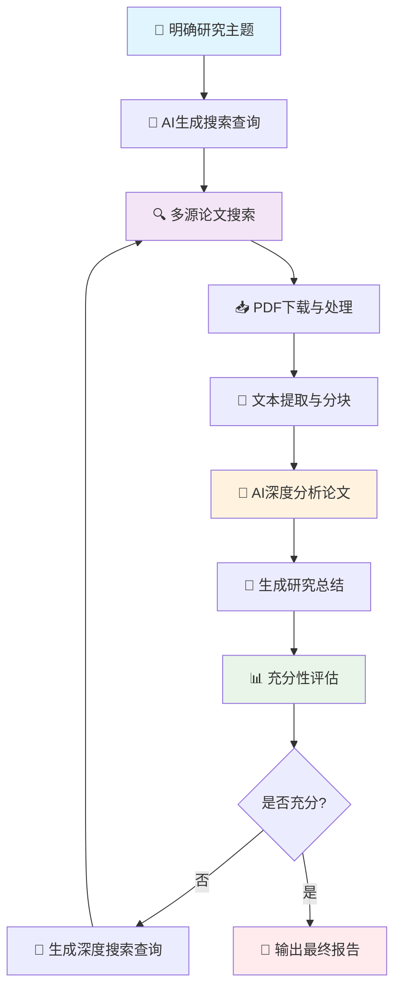
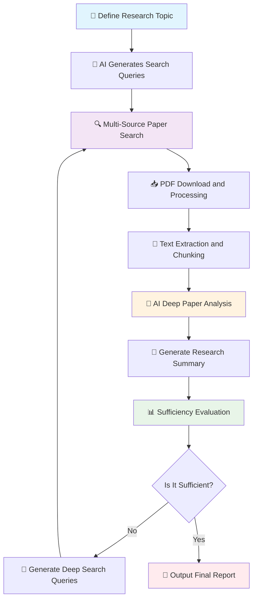

# 深研星图 / DeepResearch Constellation

<div align="center">

**基于DeepSeek-R1的智能学术深度研究系统**
**Intelligent Academic Deep Research System based on DeepSeek-R1**

[](https://python.org)
[](LICENSE)
[](https://deepseek.com)

[中文](#中文文档) | [English](#english-documentation)

</div>

---

## 中文文档

### 📖 项目简介

**深研星图**是一个基于DeepSeek-R1（当然，你可以修改成任何你喜欢的大模型）强推理能力的智能学术研究系统，专门设计用于自动化的学术文献深度研究。系统能够自动搜索（其中允许筛选超过60种计算机领域顶会顶刊！）、下载、分析超过100篇学术论文，并通过多轮迭代优化研究的充分性，最终生成高质量的研究综述报告。

### 🎯 项目动机

当前的DeepResearch AI研究助手（GPT，gemini等）存在以下局限性：

* 缺少针对DeepSeek-R1强推理与分析能力的专门优化
* 现有DeepResearch系统很少直接阅读大量文献的全文内容
* 缺乏智能的研究充分性评估和迭代优化机制
* 论文获取成功率不高，容错能力有限
* **贵**（相比200美刀一个月的GPT等，本项目采用DeepSeek R1-0528时运行一次只要0.2RMB左右!!!!!!!!）

### 🌟 核心特性

* **🧠 强推理分析**：基于DeepSeek-R1的强推理能力进行深度论文分析
* **🔍 多源智能搜索**：Google Scholar → scholarly → DBLP → arXiv 四级搜索策略
* **📥 增强PDF获取**：多重备用下载机制，支持10+种学术平台
* **📊 充分性评估**：每轮自动评估研究充分性，智能决定是否继续搜索
* **⚡ 并发处理**：支持多线程并发论文分析，大幅提升效率
* **🎯 模糊匹配**：智能去重和模糊匹配，避免重复分析
* **📈 迭代优化**：多轮深度搜索，逐步完善研究覆盖面

### 📁 项目结构

```
深研星图/
├── 📄 main_DeepResearch.py      # 主程序入口
├── 🧠 deepseek_client.py        # DeepSeek AI客户端
├── 🔍 paper_searcher.py         # 多源论文搜索器  
├── 📥 pdf_processor.py          # PDF下载与处理器
├── ⚙️ config.py                 # 系统配置文件
├── 🎮 demo_research.py          # 快速演示脚本
├── 📋 requirements.txt          # 依赖包列表
├── 📁 downloads/               # 论文下载目录 (自动创建)
├── 📁 output/                  # 结果输出目录 (自动创建)
├── 📁 demo_downloads/          # 演示下载目录 (自动创建)
└── 📄 README.md                # 项目说明文档
```

### 🔄 系统流程



### ⚙️ 技术实现

#### 🔍 多源论文搜索

采用**四级搜索策略**确保最大覆盖率：

```
🥇 Google Scholar (主要) → 🥈 scholarly库 (补充) → 🥉 DBLP (学术) → 🏅 arXiv (开放)
```

**核心特性：**

* 智能查询生成和优化
* 模糊匹配和精确去重
* 会议/期刊筛选支持
* 引用数和时间范围过滤

#### 📥 增强PDF获取系统

**多重容错机制**防止下载失败：

```python
# 优先级排序策略
arXiv (最高) → 开放平台 → 直接PDF → 机构仓库 → 出版商平台
```

**专门处理器支持：**

* arXiv、ResearchGate、Academia.edu
* IEEE、ACM、Springer、Nature
* ScienceDirect、Semantic Scholar

#### 🧠 AI深度分析引擎

**累积式分析方法：**

```
摘要 + 第1块 → 分析1 → 分析1 + 第2块 → 分析2 → ... → 最终分析
```

**并发处理能力：**

* 支持最多 8 个并发分析线程
* 智能 API 密钥轮换
* 自动负载均衡和错误恢复

#### 📊 智能充分性评估

**多维度评估指标：**

* 覆盖度评估 (主要研究方向)
* 深度评估 (理论基础和技术细节)
* 时效性评估 (最新研究进展)
* 完整性评估 (研究空白识别)

### 🚀 快速开始

#### 1. 环境准备

```bash
# 克隆项目
git clone https://github.com/Cyan9061/DeepResearch-Constellation.git
cd DeepResearch-Constellation

# 安装依赖
pip install -r requirements.txt
```

### ⚙️ 详细配置说明

#### 核心 API 配置 (必须设置)

编辑 `config.py` 文件，根据您的情况配置以下参数：

##### 1. **API 密钥配置**

```python
# 普通分析 API 密钥 (必须)
API_KEYS = [
    "sk-your-api-key-1",
    "sk-your-api-key-2",
    "sk-your-api-key-3",
    # 建议至少配置 3-5 个密钥支持并发处理
]

# 高级总结 API 密钥 (可选，用于更强大的模型)
API_KEYS_2 = [
    "sk-your-premium-api-key-1",
    "sk-your-premium-api-key-2",
    # 如果为空，将使用普通 API_KEYS
]
```

**配置建议：**

* **API\_KEYS**：用于常规论文分析，建议配置 3-8 个密钥以支持并发处理
* **API\_KEYS\_2**：用于最终研究总结和充分性评估，可使用更强大的模型密钥
* 如果只有一套密钥，可将 `API_KEYS_2` 留空，系统会自动使用 `API_KEYS`

##### 2. **API 端点和模型配置**

```python
# API 服务端点
API_ENDPOINT = "https://api.siliconflow.cn/v1/chat/completions"
SUMMARY_API_ENDPOINT = "https://api.siliconflow.cn/v1/chat/completions"

# 模型选择
MODEL_NAME = "deepseek-ai/DeepSeek-R1-0528-Qwen3-8B"  # 普通分析模型
SUMMARY_MODEL_NAME = "deepseek-ai/DeepSeek-R1"        # 高级总结模型
```

**配置建议：**

* **API\_ENDPOINT**：根据您的 API 提供商修改，支持 OpenAI 兼容接口
* **MODEL\_NAME**：用于论文分析，建议使用平衡版本（成本 vs 性能）
* **SUMMARY\_MODEL\_NAME**：用于最终总结，建议使用最强版本以获得最佳质量

#### 性能与处理配置

##### 3. **Token 和上下文配置**

```python
MODEL_CONTEXT_SIZE = 96 * 1000         # 96K tokens 上下文
MAX_TOKENS_PER_REQUEST = 8192          # 普通分析每次最大 token 数
SUMMARY_MAX_TOKENS_PER_REQUEST = 16384 # 总结分析每次最大 token 数，不要大于 max_token，也可以保守设置为 8192
```

**配置建议：**

* **MODEL\_CONTEXT\_SIZE**：根据您使用的模型调整（如 32K、128K 等）
* **MAX\_TOKENS\_PER\_REQUEST**：普通分析输出长度，8192 适合大多数情况
* **SUMMARY\_MAX\_TOKENS\_PER\_REQUEST**：最终总结输出长度，建议设置更大值

##### 4. **搜索深度配置**

```python
SEARCH_DEPTH = 5                # 最大搜索轮数
MAX_PAPERS_PER_DEPTH = 48       # 每轮最大处理论文数
```

**个人化设置建议：**

* **快速研究** (15 分钟内)：`SEARCH_DEPTH=2`, `MAX_PAPERS_PER_DEPTH=20`
* **标准研究** (1 小时内)：`SEARCH_DEPTH=3`, `MAX_PAPERS_PER_DEPTH=30`
* **深度研究** (1-2 小时)：`SEARCH_DEPTH=5`, `MAX_PAPERS_PER_DEPTH=48`
* **全面研究** (2 小时以上)：`SEARCH_DEPTH=7`, `MAX_PAPERS_PER_DEPTH=60`

##### 5. **并发处理配置**

```python
MAX_CONCURRENT_ANALYSIS = 8     # 最大并发分析线程数，不能大于 API_KEYS 数量
CONCURRENT_BATCH_SIZE = 8       # 每批并发处理的论文数量，不能大于 API_KEYS 数量
```

**注意事项：**

* 并发数不应超过 API 密钥数量
* 过高的并发可能触发 API 限流
* 建议从较低配置开始测试

#### 快速配置模板

##### 🚀 新手推荐配置

```python
SEARCH_DEPTH = 2
MAX_PAPERS_PER_DEPTH = 20
MAX_CONCURRENT_ANALYSIS = 3
CONCURRENT_BATCH_SIZE = 4
# 预计用时：20-40 分钟
```

#### 3. 运行演示

```bash
# 快速演示
python demo_research.py

# 完整研究流程,建议初次使用不筛选会议
python main_DeepResearch.py
```

### 🎮 未来改进方向

#### 1. **📥 增强论文下载系统**

* **智能 Fallback 机制**：需求 20 篇 → 第一轮 10 篇成功 → 继续爬取 → 直到达到目标或上限
* **代理池支持**：分布式爬虫避免 IP 限制
* **增量更新**：支持论文库增量更新和缓存机制

#### 2. **🧠 Prompt 优化工程**

* **领域自适应 Prompt**：针对不同学科定制化提示词
* **Chain-of-Thought 优化**：强化多步推理和分析链路
* **Few-shot 示例库**：构建高质量分析示例库

#### 3. **📊 充分性评估升级**

* **多专家集成评估**：结合多个 AI 专家评估意见
* **量化指标体系**：建立更精确的评估量化标准
* **领域知识图谱**：集成学科知识图谱指导评估

#### 4. **📖 智能文本分块**

* **结构化分块**：基于论文目录和章节的智能分割
* **语义相关性分块**：保持语义连贯性的分块策略
* **多粒度分析**：支持段落、章节、全文多层次分析

#### 5. **🌳 大规模分析架构**

* **归并树结构**：处理超大规模论文集的层次化分析
* **分布式调度**：支持集群化的大规模并行处理
* **增量分析**：支持增量论文添加和更新分析

#### 6. **🎨 用户界面优化**

* **Web 可视化界面**：实时进度展示和交互操作
* **研究地图可视化**：论文关系网络和知识图谱展示
* **导出多格式**：支持 PDF、Word、LaTeX 等多种导出格式

#### 7. **⚡ 性能与扩展性**

* **模型适配器**：支持多种大模型的无缝切换
* **缓存优化**：智能缓存减少重复计算
* **流式处理**：支持实时流式分析和反馈，乃至流水线处理

#### 8. **🔒 企业级特性**

* **权限管理**：多用户权限控制和项目管理
* **审计日志**：完整的操作记录和可追溯性
* **私有部署**：支持企业内网私有化部署

---

## License

本项目采用 MIT 许可证。详情请参见 [LICENSE](LICENSE)。

⭐ **如果这个项目对您有帮助，请给我们一个Star！**  

---

## English Documentation

### 📖 Project Overview

**DeepResearch Constellation** is an intelligent academic deep research system built on the powerful reasoning capabilities of DeepSeek-R1. It is specifically designed for automated deep-dive exploration of academic literature. The system can automatically search（More than 60 top conferences and journals in the computer science field are accessible!）, download, and analyze a large number of academic papers, and through multiple iterative rounds, optimize research completeness, ultimately generating a high-quality research review report.

### 🎯 Motivation

Current DeepResearch AI research assistants have the following limitations:

* Lack of specialized optimization for DeepSeek-R1’s strong reasoning and analytical capabilities
* Existing DeepResearch systems rarely read the full text of a large volume of literature directly
* Lack of intelligent research sufficiency evaluation and iterative optimization mechanisms
* Low success rate in paper acquisition and limited fault tolerance
* **expensive**(Compared to GPT and others that cost around $200 per month, this project only costs about 0.2 RMB(about $0.0278) per run when using DeepSeek R1-0528!!!!!!!!)

### 🌟 Core Features

* **🧠 Advanced Reasoning and Analysis**: Deep paper analysis based on DeepSeek-R1’s strong reasoning capabilities
* **🔍 Multi-Source Intelligent Search**: Four-level search strategy: Google Scholar → scholarly → DBLP → arXiv
* **📥 Enhanced PDF Acquisition**: Multiple fallback download mechanisms supporting 10+ academic platforms
* **📊 Sufficiency Evaluation**: Automatic research sufficiency assessment each round, intelligently deciding whether to continue searching
* **⚡ Concurrent Processing**: Multi-threaded concurrent paper analysis, significantly improving efficiency
* **🎯 Fuzzy Matching**: Intelligent deduplication and fuzzy matching to avoid repeated analysis
* **📈 Iterative Optimization**: Multi-round deep search to gradually improve research coverage

### 📁 Project Structure

```
DeepResearch Constellation/
├── 📄 main_DeepResearch.py      # Main entry point
├── 🧠 deepseek_client.py        # DeepSeek AI client
├── 🔍 paper_searcher.py         # Multi-source paper searcher  
├── 📥 pdf_processor.py          # PDF downloader and processor
├── ⚙️ config.py                 # System configuration file
├── 🎮 demo_research.py          # Quick demonstration script
├── 📋 requirements.txt          # Dependencies list
├── 📁 downloads/               # Paper download directory (auto-created)
├── 📁 output/                  # Output directory (auto-created)
├── 📁 demo_downloads/          # Demo download directory (auto-created)
└── 📄 README.md                # Project documentation
```

### 🔄 System Workflow



### ⚙️ Technical Implementation

#### 🔍 Multi-Source Paper Search

The system adopts a **four-level search strategy** to ensure maximum coverage:

```
🥇 Google Scholar (primary) → 🥈 scholarly library (supplement) → 🥉 DBLP (academic) → 🏅 arXiv (open access)
```

**Key Features:**

* Intelligent query generation and optimization
* Fuzzy matching and precise deduplication
* Conference/journal filtering support
* Citation count and time range filtering

#### 📥 Enhanced PDF Acquisition System

A **multi-layered fallback mechanism** prevents download failures:

```python
# Priority ranking
arXiv (highest) → Open platforms → Direct PDF → Institutional repositories → Publisher platforms
```

**Supported Sources:**

* arXiv, ResearchGate, Academia.edu
* IEEE, ACM, Springer, Nature
* ScienceDirect, Semantic Scholar

#### 🧠 AI Deep Analysis Engine

**Cumulative Analysis Method:**

```
Abstract + Chunk 1 → Analysis 1 → Analysis 1 + Chunk 2 → Analysis 2 → ... → Final Analysis
```

**Concurrency Features:**

* Up to 8 concurrent analysis threads
* Intelligent API key rotation
* Automatic load balancing and error recovery

#### 📊 Intelligent Sufficiency Evaluation

**Multi-dimensional Evaluation Metrics:**

* Coverage Evaluation (main research directions)
* Depth Evaluation (theoretical basis and technical details)
* Timeliness Evaluation (latest research progress)
* Completeness Evaluation (identifying research gaps)

---

### 🚀 Quick Start

#### 1. Environment Setup

```bash
# Clone the repository
git clone https://github.com/Cyan9061/DeepResearch-Constellation.git
cd DeepResearch-Constellation

# Install dependencies
pip install -r requirements.txt
```

### ⚙️ Detailed Configuration Guide

#### Core API Configuration (Required)

Edit the `config.py` file and configure the following parameters according to your environment:

##### 1. **API Key Configuration**

```python
# Regular Analysis API Keys (required)
API_KEYS = [
    "sk-your-api-key-1",
    "sk-your-api-key-2",
    "sk-your-api-key-3",
    # It is recommended to configure at least 3-5 keys for concurrent processing
]

# Advanced Summarization API Keys (optional, for more powerful models)
API_KEYS_2 = [
    "sk-your-premium-api-key-1",
    "sk-your-premium-api-key-2",
    # If empty, the system will use API_KEYS
]
```

**Configuration Recommendations:**

* **API\_KEYS**: Used for regular paper analysis. It is recommended to configure 3-8 keys to support concurrent processing.
* **API\_KEYS\_2**: Used for the final research summary and sufficiency evaluation. You can use stronger model keys.
* If you only have one set of keys, leave `API_KEYS_2` empty. The system will automatically use `API_KEYS`.

##### 2. **API Endpoint and Model Configuration**

```python
# API service endpoints
API_ENDPOINT = "https://api.siliconflow.cn/v1/chat/completions"
SUMMARY_API_ENDPOINT = "https://api.siliconflow.cn/v1/chat/completions"

# Model selection
MODEL_NAME = "deepseek-ai/DeepSeek-R1-0528-Qwen3-8B"  # Model for regular analysis
SUMMARY_MODEL_NAME = "deepseek-ai/DeepSeek-R1"        # Model for advanced summarization
```

**Configuration Recommendations:**

* **API\_ENDPOINT**: Modify according to your API provider, supports OpenAI-compatible interfaces.
* **MODEL\_NAME**: Used for paper analysis. It is recommended to choose a balanced version (cost vs. performance).
* **SUMMARY\_MODEL\_NAME**: Used for final summarization. It is recommended to choose the strongest version for the best quality.

#### Performance and Processing Configuration

##### 3. **Token and Context Configuration**

```python
MODEL_CONTEXT_SIZE = 96 * 1000         # 96K tokens context size
MAX_TOKENS_PER_REQUEST = 8192          # Max tokens per request for regular analysis
SUMMARY_MAX_TOKENS_PER_REQUEST = 16384 # Max tokens per request for summarization (should not exceed model's max tokens; 8192 is also conservative)
```

**Configuration Recommendations:**

* **MODEL\_CONTEXT\_SIZE**: Adjust according to the model you are using (e.g., 32K, 128K, etc.).
* **MAX\_TOKENS\_PER\_REQUEST**: Output length for regular analysis. 8192 fits most use cases.
* **SUMMARY\_MAX\_TOKENS\_PER\_REQUEST**: Output length for final summarization. It is recommended to set a larger value.

##### 4. **Search Depth Configuration**

```python
SEARCH_DEPTH = 5                # Maximum number of search rounds
MAX_PAPERS_PER_DEPTH = 48       # Maximum number of papers processed per round
```

**Personalized Settings Recommendations:**

* **Quick Research** (within 15 minutes): `SEARCH_DEPTH=2`, `MAX_PAPERS_PER_DEPTH=20`
* **Standard Research** (within 1 hour): `SEARCH_DEPTH=3`, `MAX_PAPERS_PER_DEPTH=30`
* **Deep Research** (1–2 hours): `SEARCH_DEPTH=5`, `MAX_PAPERS_PER_DEPTH=48`
* **Comprehensive Research** (over 2 hours): `SEARCH_DEPTH=7`, `MAX_PAPERS_PER_DEPTH=60`

##### 5. **Concurrency Configuration**

```python
MAX_CONCURRENT_ANALYSIS = 8     # Maximum concurrent analysis threads, should not exceed number of API_KEYS
CONCURRENT_BATCH_SIZE = 8       # Number of papers processed concurrently per batch, should not exceed number of API_KEYS
```

**Notes:**

* Concurrency should not exceed the number of API keys.
* Too high concurrency may trigger API rate limits.
* It is recommended to start testing at a lower configuration.

#### Quick Configuration Template

##### 🚀 Beginner Recommended Configuration

```python
SEARCH_DEPTH = 2
MAX_PAPERS_PER_DEPTH = 20
MAX_CONCURRENT_ANALYSIS = 3
CONCURRENT_BATCH_SIZE = 4
# Estimated time: 20–40 minutes
```

#### 3. Run Demonstration

```bash
# Quick demonstration
python demo_research.py

# Full research pipeline
python main_DeepResearch.py
```

### 🎮 Usage Examples

#### 1. **📥 Enhanced Paper Download System**

* **Intelligent Fallback Mechanism**: Request 20 papers → First round 10 succeed → Continue crawling → Until goal or limit is reached
* **Proxy Pool Support**: Distributed crawling to avoid IP restrictions
* **Incremental Updates**: Supports incremental updates and caching of the paper library

#### 2. **🧠 Prompt Engineering Optimization**

* **Domain-Adaptive Prompts**: Customized prompts for different disciplines
* **Chain-of-Thought Optimization**: Strengthened multi-step reasoning and analysis chains
* **Few-shot Example Library**: Build a high-quality example library for analysis

#### 3. **📊 Enhanced Sufficiency Evaluation**

* **Multi-Expert Ensemble Evaluation**: Combine evaluations from multiple AI experts
* **Quantitative Metric System**: Establish more precise quantitative evaluation standards
* **Domain Knowledge Graph**: Integrate disciplinary knowledge graph to guide evaluation

#### 4. **📖 Intelligent Text Chunking**

* **Structured Chunking**: Intelligent splitting based on paper outline and sections
* **Semantic Coherence Chunking**: Chunking strategy that maintains semantic continuity
* **Multi-Granularity Analysis**: Support multi-level analysis of paragraph, section, and full text

#### 5. **🌳 Large-Scale Analysis Architecture**

* **Merge Tree Structure**: Hierarchical analysis for ultra-large-scale paper collections
* **Distributed Scheduling**: Support for cluster-based large-scale parallel processing
* **Incremental Analysis**: Support incremental addition and update of papers for analysis

#### 6. **🎨 User Interface Optimization**

* **Web Visualization Interface**: Real-time progress display and interactive operations
* **Research Map Visualization**: Display paper relationship networks and knowledge graphs
* **Multiple Export Formats**: Support export to PDF, Word, LaTeX, etc.

#### 7. **⚡ Performance and Scalability**

* **Model Adapters**: Support seamless switching between various large models
* **Cache Optimization**: Intelligent caching to reduce redundant computations
* **Streaming Processing**: Support real-time streaming analysis and feedback, even pipeline processing

#### 8. **🔒 Enterprise-Level Features**

* **Permission Management**: Multi-user permission control and project management
* **Audit Logs**: Complete operation records and traceability
* **Private Deployment**: Support for private network deployment within enterprises

---

## License

This project is licensed under the MIT License. See the [LICENSE](LICENSE) file for details.

如果这个项目对您有帮助，请给我们一个 Star！

---

## 英文文档

### 📖 Project Introduction

**DeepResearch Constellation** is an intelligent academic deep research system based on the powerful reasoning capabilities of DeepSeek-R1. It is designed specifically for automated deep research into academic literature. The system can automatically search, download, and analyze a large volume of academic papers, and through multiple iterative rounds, optimize the sufficiency of research, ultimately generating a high-quality review report of the research findings. We apologize for not maintaining complete English annotations; we will supplement them in the future.

### 🎯 Project Motivation

Current AI research assistants have the following limitations:

* Lack of specialized optimization for DeepSeek-R1’s strong reasoning and analytical capabilities
* Existing DeepResearch systems seldom read the full text of a large number of papers directly
* Lack of an intelligent mechanism for evaluating research sufficiency and iterative optimization
* Low success rate for paper acquisition and limited fault tolerance

### 🌟 Core Features

* **🧠 Advanced Reasoning and Analysis**: Deep paper analysis powered by DeepSeek-R1’s strong reasoning capabilities
* **🔍 Multi-Source Intelligent Search**: A four-level search strategy: Google Scholar → scholarly → DBLP → arXiv
* **📥 Enhanced PDF Acquisition**: Multiple fallback download mechanisms supporting over 10 academic platforms
* **📊 Sufficiency Evaluation**: Automated assessment of research sufficiency each round, intelligently deciding whether to continue searching
* **⚡ Concurrent Processing**: Multi-threaded concurrent analysis of papers, significantly improving efficiency
* **🎯 Fuzzy Matching**: Intelligent deduplication and fuzzy matching to avoid redundant analysis
* **📈 Iterative Optimization**: Multi-round deep search to gradually improve research coverage

### 📁 Project Structure

```
DeepResearch Constellation/
├── 📄 main_DeepResearch.py      # Main program entry point
├── 🧠 deepseek_client.py        # DeepSeek AI client
├── 🔍 paper_searcher.py         # Multi-source paper search module  
├── 📥 pdf_processor.py          # PDF download and processing module
├── ⚙️ config.py                 # System configuration file
├── 🎮 demo_research.py          # Quick demonstration script
├── 📋 requirements.txt          # Dependencies list
├── 📁 downloads/               # Directory for downloaded papers (auto-created)
├── 📁 output/                  # Directory for output results (auto-created)
├── 📁 demo_downloads/          # Directory for demo downloads (auto-created)
└── 📄 README.md                # Project documentation
```

### 🔄 System Workflow


### ⚙️ Technical Implementation

#### 🔍 Multi-Source Paper Search

The system employs a **four-level search strategy** to ensure maximum coverage:

```
🥇 Google Scholar (primary) → 🥈 scholarly library (supplement) → 🥉 DBLP (academic) → 🏅 arXiv (open access)
```

**Key Features:**

* Intelligent query generation and optimization
* Fuzzy matching and precise deduplication
* Conference/journal filtering support
* Citation count and time range filtering

#### 📥 Enhanced PDF Acquisition System

A **multi-layered fallback mechanism** prevents download failures:

```python
# Priority ranking
arXiv (highest) → Open platforms → Direct PDF → Institutional repositories → Publisher platforms
```

**Supported Sources Include:**

* arXiv, ResearchGate, Academia.edu
* IEEE, ACM, Springer, Nature
* ScienceDirect, Semantic Scholar

#### 🧠 AI Deep Analysis Engine

**Cumulative Analysis Method:**

```
Abstract + Chunk 1 → Analysis 1 → Analysis 1 + Chunk 2 → Analysis 2 → ... → Final Analysis
```

**Concurrency Features:**

* Supports up to 8 concurrent analysis threads
* Intelligent API key rotation
* Automatic load balancing and error recovery

#### 📊 Intelligent Sufficiency Evaluation

**Multi-dimensional Evaluation Metrics:**

* Coverage Evaluation (main research directions)
* Depth Evaluation (theoretical basis and technical details)
* Timeliness Evaluation (latest research progress)
* Completeness Evaluation (identification of research gaps)

---

### 🚀 Quick Start

#### 1. Environment Setup

```bash
# Clone the repository
git clone https://github.com/Cyan9061/DeepResearch-Constellation.git
cd DeepResearch-Constellation

# Install dependencies
pip install -r requirements.txt
```

### ⚙️ Detailed Configuration Guide

#### Core API Configuration (Required)

Edit the `config.py` file and configure the following parameters according to your environment:

##### 1. **API Key Configuration**

```python
# Regular Analysis API Keys (required)
API_KEYS = [
    "sk-your-api-key-1",
    "sk-your-api-key-2",
    "sk-your-api-key-3",
    # It is recommended to configure at least 3-5 keys for concurrent processing
]

# Advanced Summarization API Keys (optional, for more powerful models)
API_KEYS_2 = [
    "sk-your-premium-api-key-1",
    "sk-your-premium-api-key-2",
    # If empty, the system will use API_KEYS
]
```

**Configuration Recommendations:**

* **API\_KEYS**: Used for regular paper analysis. It is recommended to configure 3-8 keys to support concurrent processing.
* **API\_KEYS\_2**: Used for the final research summary and sufficiency evaluation. You can use stronger model keys.
* If you only have one set of keys, leave `API_KEYS_2` empty. The system will automatically use `API_KEYS`.

##### 2. **API Endpoint and Model Configuration**

```python
# API service endpoints
API_ENDPOINT = "https://api.siliconflow.cn/v1/chat/completions"
SUMMARY_API_ENDPOINT = "https://api.siliconflow.cn/v1/chat/completions"

# Model selection
MODEL_NAME = "deepseek-ai/DeepSeek-R1-0528-Qwen3-8B"  # Model for regular analysis
SUMMARY_MODEL_NAME = "deepseek-ai/DeepSeek-R1"        # Model for advanced summarization
```

**Configuration Recommendations:**

* **API\_ENDPOINT**: Modify according to your API provider, supports OpenAI-compatible interfaces.
* **MODEL\_NAME**: Used for paper analysis. It is recommended to choose a balanced version (cost vs. performance).
* **SUMMARY\_MODEL\_NAME**: Used for final summarization. It is recommended to choose the strongest version for the best quality.

#### Performance and Processing Configuration

##### 3. **Token and Context Configuration**

```python
MODEL_CONTEXT_SIZE = 96 * 1000         # 96K tokens context size
MAX_TOKENS_PER_REQUEST = 8192          # Max tokens per request for regular analysis
SUMMARY_MAX_TOKENS_PER_REQUEST = 16384 # Max tokens per request for summarization (should not exceed the model's max tokens; 8192 is also conservative)
```

**Configuration Recommendations:**

* **MODEL\_CONTEXT\_SIZE**: Adjust according to the model you are using (e.g., 32K, 128K, etc.)
* **MAX\_TOKENS\_PER\_REQUEST**: Output length for regular analysis. 8192 fits most use cases.
* **SUMMARY\_MAX\_TOKENS\_PER\_REQUEST**: Output length for final summarization. It is recommended to set a larger value.

##### 4. **Search Depth Configuration**

```python
SEARCH_DEPTH = 5                # Maximum number of search rounds
MAX_PAPERS_PER_DEPTH = 48       # Maximum number of papers processed per round
```

**Personalized Settings Recommendations:**

* **Quick Research** (within 15 minutes): `SEARCH_DEPTH=2`, `MAX_PAPERS_PER_DEPTH=20`
* **Standard Research** (within 1 hour): `SEARCH_DEPTH=3`, `MAX_PAPERS_PER_DEPTH=30`
* **Deep Research** (1–2 hours): `SEARCH_DEPTH=5`, `MAX_PAPERS_PER_DEPTH=48`
* **Comprehensive Research** (over 2 hours): `SEARCH_DEPTH=7`, `MAX_PAPERS_PER_DEPTH=60`

##### 5. **Concurrency Configuration**

```python
MAX_CONCURRENT_ANALYSIS = 8     # Maximum concurrent analysis threads, should not exceed number of API_KEYS
CONCURRENT_BATCH_SIZE = 8       # Number of papers processed concurrently per batch, should not exceed number of API_KEYS
```

**Notes:**

* Concurrency should not exceed the number of API keys.
* Too high concurrency may trigger API rate limits.
* It is recommended to start testing at a lower configuration.

#### Quick Configuration Template

##### 🚀 Beginner Recommended Configuration

```python
SEARCH_DEPTH = 2
MAX_PAPERS_PER_DEPTH = 20
MAX_CONCURRENT_ANALYSIS = 3
CONCURRENT_BATCH_SIZE = 4
# Estimated time: 20–40 minutes
```

#### 3. Run Demonstration

```bash
# Quick demonstration
python demo_research.py

# Full research pipeline,recommend turning off conference filter when first running
python main_DeepResearch.py
```

### 🎮 Future improvement directions

#### 1. **📥 Enhanced Paper Download System**

* **Intelligent Fallback Mechanism**: Request 20 papers → First round 10 succeed → Continue crawling → Until goal or limit is reached
* **Proxy Pool Support**: Distributed crawling to avoid IP restrictions
* **Incremental Updates**: Supports incremental updates and caching of the paper library

#### 2. **🧠 Prompt Engineering Optimization**

* **Domain-Adaptive Prompts**: Customized prompts for different disciplines
* **Chain-of-Thought Optimization**: Strengthened multi-step reasoning and analysis chains
* **Few-shot Example Library**: Build a high-quality example library for analysis

#### 3. **📊 Enhanced Sufficiency Evaluation**

* **Multi-Expert Ensemble Evaluation**: Combine evaluations from multiple AI experts
* **Quantitative Metric System**: Establish more precise quantitative evaluation standards
* **Domain Knowledge Graph**: Integrate disciplinary knowledge graph to guide evaluation

#### 4. **📖 Intelligent Text Chunking**

* **Structured Chunking**: Intelligent splitting based on paper outline and sections
* **Semantic Coherence Chunking**: Chunking strategy that maintains semantic continuity
* **Multi-Granularity Analysis**: Support multi-level analysis of paragraph, section, and full text

#### 5. **🌳 Large-Scale Analysis Architecture**

* **Merge Tree Structure**: Hierarchical analysis for ultra-large-scale paper collections
* **Distributed Scheduling**: Support for cluster-based large-scale parallel processing
* **Incremental Analysis**: Support incremental addition and update of papers for analysis

#### 6. **🎨 User Interface Optimization**

* **Web Visualization Interface**: Real-time progress display and interactive operations
* **Research Map Visualization**: Display paper relationship networks and knowledge graphs
* **Multiple Export Formats**: Support export to PDF, Word, LaTeX, etc.

#### 7. **⚡ Performance and Scalability**

* **Model Adapters**: Support seamless switching between various large models
* **Cache Optimization**: Intelligent caching to reduce redundant computations
* **Streaming Processing**: Support real-time streaming analysis and feedback, even pipeline processing

#### 8. **🔒 Enterprise-Level Features**

* **Permission Management**: Multi-user permission control and project management
* **Audit Logs**: Complete operation records and traceability
* **Private Deployment**: Support for private network deployment within enterprises

---

## License

This project is licensed under the MIT License. See the [LICENSE](LICENSE) file for details.

⭐ **If this project helps you, please give us a Star!**
